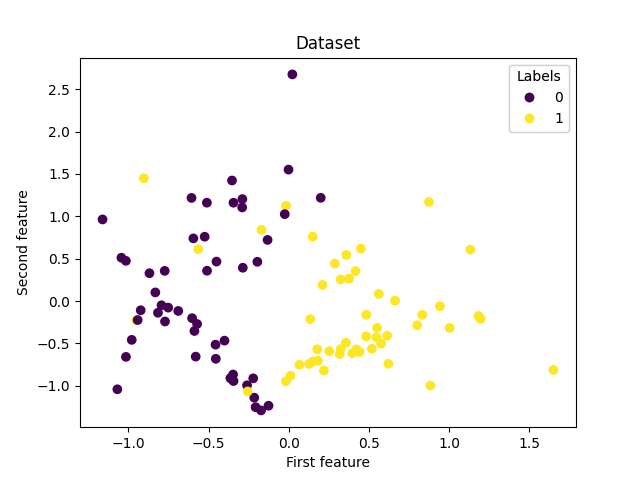

# ES 335 Assignment 1 - Task 5 Question 2

In this questions, we were asked to run our implementation of the decision tree on the given dataset that was generated using the `make_classification` function from the `sklearn.datasets` module. We first randomly shuffle the data and then split it into training and testing sets (70% and 30% respectively). We then train our decision tree on the training set and evaluate its performance on the testing set.

The plot of the given dataset looks like this:



Running the decision tree on the dataset, we get the following results:

<center>
    <table>
        <tr>
            <th colspan="2">Metric</th>
            <th>Value</th>
        </tr>
        <tr>
            <td colspan="2">Accuracy</td>
            <td>0.9667</td>
        </tr>
        <tr>
            <th rowspan="2">Class 0</th>
            <td>Precision</td>
            <td>0.9473</td>
        </tr>
        <tr>
            <td>Recall</td>
            <td>1.0000</td>
        </tr>
        <tr>
            <th rowspan="2">Class 1</th>
            <td>Precision</td>
            <td>1.0000</td>
        </tr>
        <tr>
            <td>Recall</td>
            <td>0.9166</td>
        </tr>
    </table>
</center>

The max depth of the decision tree was taken to be 5.

For the second part we do 5-fold nested cross-validation to find the best depth for the decision tree. After running the cross-validation, we get the following results:

```
Fold 0, Mean Depth Accuracies on Validation {3: 0.9125, 2: 0.9125, 4: 0.875, 5: 0.85, 8: 0.8375, 7: 0.8375, 6: 0.8375, 1: 0.5625}
Fold 0, Accuracy on Test dataset: 0.9
Fold 1, Mean Depth Accuracies on Validation {2: 0.9125, 4: 0.8875, 3: 0.8875, 8: 0.875, 7: 0.875, 6: 0.875, 5: 0.875, 1: 0.85}
Fold 1, Accuracy on Test dataset: 0.8
Fold 2, Mean Depth Accuracies on Validation {2: 0.9, 3: 0.875, 6: 0.8625, 5: 0.8625, 4: 0.8625, 8: 0.85, 7: 0.85, 1: 0.525}
Fold 2, Accuracy on Test dataset: 0.95
Fold 3, Mean Depth Accuracies on Validation {2: 0.8625, 3: 0.85, 4: 0.8125, 8: 0.775, 7: 0.775, 6: 0.775, 5: 0.775, 1: 0.525}
Fold 3, Accuracy on Test dataset: 0.95
Fold 4, Mean Depth Accuracies on Validation {4: 0.8125, 3: 0.8125, 2: 0.8125, 6: 0.7875, 5: 0.7875, 8: 0.775, 7: 0.775, 1: 0.75}
Fold 4, Accuracy on Test dataset: 0.9
Mean Accuracy accross 5 folds:  0.9000000000000001
Optimal Depths per fold:  [3, 2, 2, 2, 4]
```

If we were asked to select a single depth then the safest answer would be depth 2, because it also has the best mean accuracy on validation across all folds.
