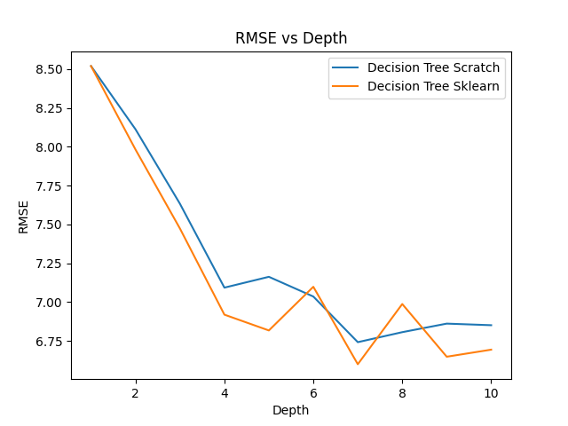

# ES 335 Assignment 1 - Task 5 Question 3

In this question we were asked to run our implementation of the decision tree for the automotive efficiency problem. We kept the depth of the tree to be 10. The dataset was split into training and testing sets (70% and 30% respectively).

We removed the rows which had missing horsepower values. We then trained our decision tree on the training set and evaluated its performance on the testing set. The results are as follows:

```
Decision Tree Scratch RMSE:  6.8508133873137
Decision Tree Sklearn RMSE:  6.645125509124343
```

Note: We have kept the depth to be constant for both the Skit-learn and Scratch implementations. The RMSE values are close to each other, which shows that our implementation is working correctly.

Below we have shown the plot of the accuracy vs depth of both the trees:



As you can see that our model performs close to the Sklearn model.
